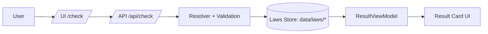
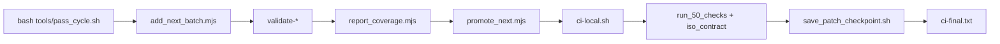
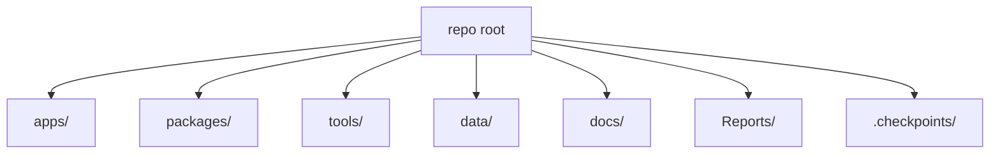

# Project Atlas

## Executive Summary
This repository powers a cannabis legality lookup product with a web UI, JSON law profiles, and a CLI-driven data/CI pipeline.
The primary runtime surface is the Next.js web app in `apps/web` serving UI routes and API endpoints (notably `/api/check`).
Law profiles live under `data/laws` (US, EU, and ISO-3166 world), with ISO-3166 as the source of truth.
The shared domain model and status logic live in `packages/shared`, consumed by the web app and tooling.
CI is standardized via `bash tools/pass_cycle.sh`, running the conveyor, validators, coverage, smoke, and checkpoint.
Coverage reporting produces `Reports/coverage-latest.json` for missing/needs-review/provisional totals.
The promotion pipeline elevates provisional entries toward `needs_review` using `data/sources/registry.json`.
Guards enforce output format and invariants for CI, smoke, and Next-step reporting.
The repo includes mobile contracts/docs and SEO scaffolding for content pages.
Data integrity relies on validators and schema checks; tooling uses deterministic (seeded) selection.
Outputs include generated SEO maps, coverage reports, and checkpoint patches.
The roadmap emphasizes ISO-249 conveyor scale, sources registry expansion, SEO quality, geo features, and UX improvements.

## Directory Map (Purpose, Inputs, Outputs)
| Path | Type | Purpose | Inputs | Outputs | Owned by | Notes |
| --- | --- | --- | --- | --- | --- | --- |
| `apps` | app | Application surfaces (web + mobile docs) | user requests, data, shared models | UI + API responses | product | Root for runtime clients |
| `apps/web` | app | Next.js web app | HTTP requests, `data/*`, `packages/shared` | HTML/JSON, API responses | web | Main runtime |
| `apps/web/src/app` | app | Route tree (pages + API) | query params, request headers | UI routes, API routes | web | App Router |
| `apps/web/src/app/api` | app | API endpoints | query params, cache hints | JSON responses | web | `/api/*` |
| `apps/web/src/app/api/check/route.ts` | app | Core legality check endpoint | `country`, `region`, `method`, cache params | `ResultViewModel` JSON | web | Contract tests |
| `apps/web/src/app/api/reverse-geocode/route.ts` | app | Reverse geocode handler | coords + method | location JSON | web | Geo pipeline |
| `apps/web/src/app/api/whereami/route.ts` | app | IP/country resolution | request IP | location JSON | web | Geo pipeline |
| `apps/web/src/app/api/paraphrase/route.ts` | app | Text paraphrase endpoint | text payload | paraphrased text | web | AI layer |
| `apps/web/src/app/api/analytics/route.ts` | app | Analytics intake | client events | ingestion status | web | Ops + metrics |
| `apps/web/src/app/api/metrics/route.ts` | app | Metrics endpoint | internal signals | metrics payload | web | Observability |
| `apps/web/src/app/check/page.tsx` | app | `/check` UI entry | query params | legality UI | web | Main UI route |
| `apps/web/src/app/result/page.tsx` | app | Results view | query params | result UI | web | Result card |
| `apps/web/src/app/trip/page.tsx` | app | Trip planner UI | query params | trip UI | web | Journey UX |
| `apps/web/src/app/is-cannabis-legal-in-[slug]/page.tsx` | app | SEO landing page | slug | static UI | web | SEO pages |
| `apps/web/src/app/is-weed-legal-in-[slug]/page.tsx` | app | SEO landing page | slug | static UI | web | SEO pages |
| `apps/web/src/app/is-cbd-legal-in-[slug]/page.tsx` | app | SEO landing page | slug | static UI | web | SEO pages |
| `apps/web/src/app/are-edibles-legal-in-[slug]/page.tsx` | app | SEO landing page | slug | static UI | web | SEO pages |
| `apps/web/src/app/are-vapes-legal-in-[slug]/page.tsx` | app | SEO landing page | slug | static UI | web | SEO pages |
| `apps/web/src/app/are-concentrates-legal-in-[slug]/page.tsx` | app | SEO landing page | slug | static UI | web | SEO pages |
| `apps/web/src/app/_components/HomeActions.tsx` | app | Home action CTA helpers | params | URLs | web | Link builder |
| `apps/web/src/components/ResultCard.tsx` | app | Result card UI | `ResultViewModel` | UI | web | Key UI |
| `apps/web/src/components/CheckErrorCard.tsx` | app | Error display | check error | UI | web | UX safety |
| `apps/web/src/components/StatusBadge.tsx` | app | Status chip | status level | UI | web | Visual status |
| `apps/web/src/lib/lawStore.ts` | lib | Loads law profiles | `data/laws/*` | profile objects | web | SSOT access |
| `apps/web/src/lib/resultViewModel.ts` | lib | Maps profile -> UI model | profile + context | `ResultViewModel` | web | Core transformer |
| `apps/web/src/lib/summary.ts` | lib | Summary copy builder | profile + extras | summary text | web | Result text |
| `apps/web/src/lib/verification.ts` | lib | Verification logic | sources + timestamps | verification status | web | Trust UX |
| `apps/web/src/lib/extras.ts` | lib | Extras evaluation | profile + flags | extras model | web | Paid/extra flags |
| `apps/web/src/lib/seo/seoMap.generated.ts` | generated | SEO slug map | `data/*`, generator | slug map | tools | Generated by tool |
| `apps/web/src/lib/geo/reverseGeocode.ts` | lib | Reverse geocode | coords | location + code | web | Geo lookup |
| `apps/web/src/lib/geo/locationResolution.ts` | lib | Normalize geo inputs | input method | location resolution | web | IP/GPS |
| `apps/web/src/lib/geo/nearestLegal.ts` | lib | Nearest legal resolver | coords + profiles | nearest location | web | Geo UX |
| `apps/web/src/lib/location/locationContext.ts` | lib | Client location state | browser signals | stored state | web | Client storage |
| `apps/web/src/lib/jurisdictionCatalog.ts` | lib | Jurisdiction index | `data/jurisdictions/*` | catalog map | web | ISO catalog |
| `apps/web/src/lib/tripStore.ts` | lib | Trip state | inputs + profiles | trip timeline | web | Trip UX |
| `apps/web/src/laws/registry.ts` | lib | In-app law registry | `data/laws/*` | registry map | web | in-app SSOT |
| `apps/web/e2e/check.mobile.spec.ts` | test | Mobile safety E2E | `/check` | UI checks | QA | Playwright |
| `apps/ios/README.md` | doc | iOS client contract | `/api/*` | integration notes | mobile | Contract oriented |
| `apps/android/README.md` | doc | Android client contract | `/api/*` | integration notes | mobile | Contract oriented |
| `packages/shared` | lib | Shared domain model | TS sources | compiled lib | shared | Reused across app/tools |
| `packages/shared/src/index.ts` | lib | Library export surface | local modules | public API | shared | Single export hub |
| `packages/shared/src/types.ts` | lib | Domain types | model defs | types | shared | ResultViewModel |
| `packages/shared/src/status.ts` | lib | Status resolution | profile + rules | status level | shared | computeStatus |
| `packages/shared/src/data/schema.ts` | lib | Data schema version | constant | version export | shared | DATA_SCHEMA_VERSION |
| `packages/shared/src/api/contract.ts` | lib | API contract version | constant | version export | shared | API_CONTRACT_VERSION |
| `packages/shared/src/extras.ts` | lib | Extras priority | local data | extras exports | shared | EXTRAS_PRIORITY |
| `packages/shared/src/extras/extrasCatalog.ts` | lib | Extras catalog | list of extras | extras metadata | shared | UX + rules |
| `packages/shared/src/confidence/computeConfidence.ts` | lib | Confidence scoring | sources + signals | confidence level | shared | Heuristic |
| `packages/shared/src/riskText.ts` | lib | Risk text map | risk flags | copy | shared | UI copy |
| `packages/shared/src/sources/trust.ts` | lib | Source scoring | url + source | trust score | shared | scoreUrl |
| `packages/shared/src/top25.json` | data | Top-25 jurisdictions | curated list | selection input | shared | smoke cases |
| `packages/shared/src/top25.ts` | lib | Top-25 helpers | top25.json | list + helpers | shared | index lookup |
| `packages/shared/src/geo/nearestLegal.ts` | lib | Nearest legal logic | coords + profiles | nearest candidate | shared | geo reuse |
| `packages/shared/src/slugMap.ts` | lib | Slug mapping | country/state | slug map | shared | SEO slugs |
| `packages/shared/src/copy/statusBanners.ts` | lib | Status banner text | status + context | copy | shared | UI messaging |
| `packages/shared/src/version.ts` | lib | App version helpers | VERSION | version string | shared | runtime metadata |
| `data` | data | Data storage root | JSON sources | SSOT law data | data | Not code |
| `data/iso3166/iso3166-1.json` | data | ISO-3166 country list | curated input | coverage source | data | 249 entries |
| `data/laws/us` | data | US state law profiles | curated JSON | API responses | data | US region layer |
| `data/laws/eu` | data | EU law profiles | curated JSON | API responses | data | EU layer |
| `data/laws/world` | data | ISO-3166 world profiles | provisional JSON | API responses | data | Conveyor target |
| `data/jurisdictions/catalog.json` | data | Jurisdiction catalog | iso list + metadata | resolver lookup | data | SSOT for catalog |
| `data/geo/country_centroids.json` | data | Country centroids | geo data | nearest legal | data | geo helpers |
| `data/geo/us_state_centroids.json` | data | US state centroids | geo data | nearest legal | data | geo helpers |
| `data/sources/registry.json` | data | Source registry | curated sources | promotion pipeline | data | kind/weight |
| `data/sources_registry/top50.json` | data | Source registry seed | curated sources | sources list | data | seed list |
| `data/reviews` | data | Manual review diffs | review JSON | audit trail | data | DE review example |
| `data/inbox` | data | Ingest staging | temp files | ingest input | data | staging area |
| `docs` | doc | Project documentation | design notes | guidance | docs | Human docs |
| `docs/API.md` | doc | API contract | endpoints | documentation | docs | `/api/check` |
| `docs/ARCHITECTURE.md` | doc | Architecture overview | design notes | guidance | docs | system design |
| `docs/DEV.md` | doc | Dev workflow | commands | dev runbook | docs | local dev |
| `docs/DATA_ADDING.md` | doc | Data pipeline | iso + law steps | process notes | docs | data ops |
| `docs/MOBILE_GUIDE.md` | doc | Mobile integration | `/api/*` | client guide | docs | mobile clients |
| `docs/OPS.md` | doc | Ops/CI | commands + checks | runbook | docs | CI ops |
| `docs/PLAN.md` | doc | Plan tracker | tasks | plan state | docs | canonical plan |
| `docs/ROADMAP_NEXT.md` | doc | Next roadmap | roadmap notes | direction | docs | short term |
| `Reports` | generated | Coverage reports | validators | coverage JSON | tools | excluded from git delta |
| `.checkpoints` | generated | Checkpoint artifacts | pass_cycle | patches + logs | tools | CI outputs |
| `tools` | tool | CLI tooling | data + config | artifacts + reports | tools | CI + data ops |
| `tools/pass_cycle.sh` | tool | CI orchestrator | repo state | ci-final, checkpoint | tools | single entrypoint |
| `tools/ci-local.sh` | tool | Full CI suite | npm scripts | CI summary | tools | called by pass_cycle |
| `tools/save_patch_checkpoint.sh` | tool | Patch checkpoint | git diff | `.checkpoints/*.patch` | tools | checkpoint writer |
| `tools/coverage/report_coverage.mjs` | tool | Coverage report | `data/laws/world` | `Reports/coverage-latest.json` | tools | missing/provisional |
| `tools/registry/add_next_batch.mjs` | tool | ISO conveyor | iso3166 + world | new world profiles | tools | deterministic seed |
| `tools/registry/repair_provisional.mjs` | tool | Fix provisional profiles | world JSON | repaired profiles | tools | cleanup utility |
| `tools/promotion/promote_next.mjs` | tool | Promote profiles | registry sources | needs_review updates | tools | source-driven |
| `tools/promotion/review_apply.mjs` | tool | Apply review file | review JSON | profile updates | tools | review ingestion |
| `tools/validate-laws.js` | tool | Basic law validation | `data/laws/*` | exit code | tools | core validation |
| `tools/validate-laws-extended.js` | tool | Review status rules | `data/laws/*` | exit code | tools | review invariants |
| `tools/validate-data-schema.mjs` | tool | Schema validator | `data/*` | exit code | tools | schema checks |
| `tools/validate-sources-registry.mjs` | tool | Source registry validation | registry JSON | exit code | tools | registry integrity |
| `tools/validate-sources-registry-extra.mjs` | tool | Registry extra validation | registry JSON | exit code | tools | extra fields |
| `tools/validate-sources-urls.mjs` | tool | URL validation | sources | exit code | tools | url integrity |
| `tools/validate-iso3166.js` | tool | ISO list validation | iso3166 JSON | exit code | tools | 249 entries |
| `tools/smoke/run_50_checks.mjs` | tool | Smoke: API contract | `/api/check` | smoke result | tools | CI smoke |
| `tools/smoke/run_iso_contract.mjs` | tool | Smoke: ISO sample | iso3166 list | smoke result | tools | CI smoke |
| `tools/smoke/run_100_jurisdictions.mjs` | tool | Smoke: jurisdictions | catalog list | smoke result | tools | extended smoke |
| `tools/smoke/check_seo_pages.mjs` | tool | Smoke: SEO pages | SEO slugs | smoke result | tools | SEO test |
| `tools/guards/run_all.mjs` | tool | Guard suite | repo state | exit code | tools | CI gate |
| `tools/guards/summary_format.mjs` | tool | CI output guard | ci-final | pass/fail | tools | output contract |
| `tools/guards/stdout_contract.mjs` | tool | Output guard | ci-final | pass/fail | tools | line count |
| `tools/guards/no_bloat_markers.mjs` | tool | Output guard | ci-final | pass/fail | tools | banned phrases |
| `tools/guards/next_line.mjs` | tool | Next-line guard | ci-final | pass/fail | tools | format guard |
| `tools/guards/no_double_checkpoint.mjs` | tool | Checkpoint guard | pass_cycle meta | pass/fail | tools | LATEST checks |
| `tools/iso3166/generate-iso3166-1.js` | tool | Generate ISO list | source data | iso3166 JSON | tools | generator |
| `tools/iso3166/import-iso3166.js` | tool | Import ISO list | iso3166 JSON | catalog updates | tools | catalog sync |
| `tools/next/next_step.mjs` | tool | Next-step generator | coverage + state | Next line | tools | ci-final line |
| `tools/gen_seo_map.mjs` | tool | SEO map generator | seo inputs | `seoMap.generated.ts` | tools | content map |
| `tools/ledger/compact.mjs` | tool | Ledger compactor | CONTINUITY | compacted ledger | tools | ledger maintenance |
| `tools/ingest/run_ingest.mjs` | tool | Ingest pipeline | data/inbox | imported data | tools | ingest path |
| `tools/refresh-laws.js` | tool | Refresh law cache | law profiles | refreshed data | tools | data maintenance |
| `tools/laws/create-provisional.mjs` | tool | Create provisional | iso3166 + sources | provisional profile | tools | single profile |
| `tools/laws-validation.js` | tool | Validation helpers | law profile | error checks | tools | shared validator |
| `tools/migrate_data_schema.mjs` | tool | Schema migration | data files | updated schema | tools | schema upgrades |
| `tools/guard-ssr.sh` | tool | SSR guard | web build | exit code | tools | SSR checks |
| `tools/git-health.sh` | tool | Git health checks | repo | exit code | tools | git sanity |
| `tools/tree-audit.sh` | tool | Tree integrity | tree listing | exit code | tools | file audit |
| `tools/where-am-i.sh` | tool | Env helper | repo | output | tools | dev helper |
| `tools/eod_safe_push.sh` | tool | End-of-day CI | ci-local | summary | tools | CI wrapper |

## Key Files and Entrypoints (Detail)

| File | Role | Key exports / CLI | Called by |
| --- | --- | --- | --- |
| `apps/web/src/app/page.tsx` | Home UI entry | Next page component | Browser routing |
| `apps/web/src/app/check/page.tsx` | Primary UI flow | Next page component | Browser routing, `apps/web/e2e/check.mobile.spec.ts` |
| `apps/web/src/app/result/page.tsx` | Result screen | Next page component | Browser routing |
| `apps/web/src/app/trip/page.tsx` | Trip planner | Next page component | Browser routing |
| `apps/web/src/app/is-cannabis-legal-in-[slug]/page.tsx` | SEO page | Next page component | SEO crawler, sitemap |
| `apps/web/src/app/is-weed-legal-in-[slug]/page.tsx` | SEO page | Next page component | SEO crawler, sitemap |
| `apps/web/src/app/is-cbd-legal-in-[slug]/page.tsx` | SEO page | Next page component | SEO crawler, sitemap |
| `apps/web/src/app/are-edibles-legal-in-[slug]/page.tsx` | SEO page | Next page component | SEO crawler, sitemap |
| `apps/web/src/app/are-vapes-legal-in-[slug]/page.tsx` | SEO page | Next page component | SEO crawler, sitemap |
| `apps/web/src/app/are-concentrates-legal-in-[slug]/page.tsx` | SEO page | Next page component | SEO crawler, sitemap |
| `apps/web/src/app/api/check/route.ts` | Core API | GET handler | UI, mobile clients, smoke tests |
| `apps/web/src/app/api/reverse-geocode/route.ts` | Geo API | GET handler | UI geo flow |
| `apps/web/src/app/api/whereami/route.ts` | Geo API | GET handler | UI geo flow |
| `apps/web/src/app/api/paraphrase/route.ts` | AI API | GET handler | UI/experiments |
| `apps/web/src/app/api/analytics/route.ts` | Analytics API | POST handler | UI telemetry |
| `apps/web/src/app/api/metrics/route.ts` | Metrics API | GET handler | Ops monitoring |
| `apps/web/src/lib/lawStore.ts` | Load law profiles | load/read helpers | API `/api/check` |
| `apps/web/src/lib/resultViewModel.ts` | View model builder | map to `ResultViewModel` | API `/api/check` |
| `apps/web/src/lib/summary.ts` | Summary text | summary builder | UI + API |
| `apps/web/src/lib/verification.ts` | Verification logic | verification helpers | API `/api/check` |
| `apps/web/src/lib/extras.ts` | Extras rules | extras helpers | API `/api/check` |
| `apps/web/src/lib/geo/reverseGeocode.ts` | Reverse geocode | `resolveReverseGeocode` | `/api/reverse-geocode` |
| `apps/web/src/lib/geo/locationResolution.ts` | Location normalization | resolution helpers | `/api/check`, `/api/whereami` |
| `apps/web/src/lib/geo/nearestLegal.ts` | Nearest legal | nearest helpers | `/api/check` (nearest) |
| `apps/web/src/lib/jurisdictionCatalog.ts` | Jurisdiction catalog | catalog helpers | API + UI |
| `apps/web/src/lib/seo/seoMap.generated.ts` | SEO slug map | generated map | SEO pages + sitemap |
| `apps/web/src/components/ResultCard.tsx` | Core UI card | React component | `/check`, `/result` |
| `apps/web/src/components/CheckErrorCard.tsx` | Error UI | React component | `/check` |
| `packages/shared/src/index.ts` | Shared API | `computeStatus`, `computeConfidence`, `DATA_SCHEMA_VERSION` | web + tools |
| `packages/shared/src/types.ts` | Domain types | `JurisdictionLawProfile`, `ResultViewModel` | web + tools |
| `packages/shared/src/status.ts` | Status logic | `computeStatus` | web + tools |
| `packages/shared/src/data/schema.ts` | Schema version | `DATA_SCHEMA_VERSION` | API responses, validation |
| `packages/shared/src/api/contract.ts` | API contract | `API_CONTRACT_VERSION` | API responses |
| `packages/shared/src/confidence/computeConfidence.ts` | Confidence scoring | `computeConfidence` | web + tools |
| `packages/shared/src/sources/trust.ts` | Trust scoring | `scoreUrl` | promotion + UI |
| `packages/shared/src/riskText.ts` | Risk copy | `riskTextFor` | UI |
| `packages/shared/src/extras/extrasCatalog.ts` | Extras catalog | `EXTRAS_CATALOG` | UI + API |
| `packages/shared/src/top25.json` | Top-25 list | data file | smoke tests |
| `data/iso3166/iso3166-1.json` | ISO source | 249 entries | coverage, conveyor, validation |
| `data/laws/us` | US laws | JSON profiles | API `/api/check` |
| `data/laws/eu` | EU laws | JSON profiles | API `/api/check` |
| `data/laws/world` | World laws | JSON profiles | API `/api/check`, conveyor |
| `data/jurisdictions/catalog.json` | Jurisdiction catalog | JSON map | API + UI |
| `data/sources/registry.json` | Source registry | JSON registry | promotion, validation |
| `tools/pass_cycle.sh` | CI entrypoint | `bash tools/pass_cycle.sh` | operators + automation |
| `tools/ci-local.sh` | Full CI | `bash tools/ci-local.sh` | pass_cycle |
| `tools/registry/add_next_batch.mjs` | ISO conveyor | `--count`, `--seed` | pass_cycle |
| `tools/promotion/promote_next.mjs` | Promotion | `--count`, `--seed` | pass_cycle |
| `tools/coverage/report_coverage.mjs` | Coverage report | no flags | pass_cycle, Next-step |
| `tools/smoke/run_50_checks.mjs` | Smoke | `--baseUrl`, `--n`, `--seed` | ci-local |
| `tools/smoke/run_iso_contract.mjs` | ISO smoke | `--count`, `--seed` | pass_cycle |
| `tools/validate-laws.js` | Law validation | no flags | pass_cycle, CI |
| `tools/validate-laws-extended.js` | Review validation | no flags | pass_cycle |
| `tools/validate-iso3166.js` | ISO validation | no flags | pass_cycle, CI |
| `tools/gen_seo_map.mjs` | SEO generator | no flags | ci-local |
| `tools/next/next_step.mjs` | Next-line generator | `--ciStatus` | pass_cycle |
| `tools/save_patch_checkpoint.sh` | Checkpoint writer | no flags | pass_cycle |

### Web UI Entrypoints
- `apps/web/src/app/page.tsx`: Home page; dispatches user to `/check` or SEO routes. Key exports: Next page component. Used by: browser routing.
- `apps/web/src/app/check/page.tsx`: Main search UI; builds `/api/check` request from query params. Key exports: Next page component. Used by: browser routing, E2E tests.
- `apps/web/src/app/result/page.tsx`: Result view page for completed checks. Key exports: Next page component. Used by: browser routing.
- `apps/web/src/app/trip/page.tsx`: Trip planning UI. Key exports: Next page component. Used by: browser routing.
- SEO pages (`apps/web/src/app/*[slug]/page.tsx`): Static SEO entrypoints. Inputs: slug. Outputs: SEO HTML. Used by: search crawlers.

### API Endpoints
- `apps/web/src/app/api/check/route.ts`: Inputs: `country`, `region`, `method`, cache hints; Outputs: `ResultViewModel`. Used by: UI, mobile clients, smoke tests.
- `apps/web/src/app/api/reverse-geocode/route.ts`: Inputs: `lat`, `lon`, `method`; Outputs: ISO codes + resolution. Used by: geo UX.
- `apps/web/src/app/api/whereami/route.ts`: Inputs: request IP; Outputs: location hint. Used by: geo UX.
- `apps/web/src/app/api/paraphrase/route.ts`: Inputs: text payload; Outputs: paraphrase. Used by: AI UX.
- `apps/web/src/app/api/analytics/route.ts`: Inputs: event payload; Outputs: status. Used by: analytics pipeline.
- `apps/web/src/app/api/metrics/route.ts`: Inputs: none; Outputs: metrics. Used by: ops/monitoring.

### Shared Package Exports
- `packages/shared/src/index.ts`: Primary export surface. Key exports: `computeStatus`, `computeConfidence`, `DATA_SCHEMA_VERSION`, `API_CONTRACT_VERSION`, `STATUS_BANNERS`, `EXTRAS_CATALOG`, `riskTextFor`, `nearestLegalCountry`. Used by: `apps/web`, tools.
- `packages/shared/src/types.ts`: Type definitions (`JurisdictionLawProfile`, `ResultViewModel`, `Source`). Used by: web + tooling.
- `packages/shared/src/status.ts`: Status evaluation. Used by: result mapping.
- `packages/shared/src/data/schema.ts`: Schema version. Used by: API responses and validations.
- `packages/shared/src/sources/trust.ts`: URL trust scoring. Used by: review/promotion and UI.

### CLI/Tool Entrypoints
- `tools/pass_cycle.sh`: Full CI pipeline; runs conveyor, validators, coverage, smoke, checkpoint, ci-final. Used by: operators and automation.
- `tools/ci-local.sh`: Full test suite. Used by: pass_cycle.
- `tools/registry/add_next_batch.mjs`: CLI flags: `--count`, `--seed`. Creates new `data/laws/world/*.json`. Used by: pass_cycle conveyor.
- `tools/promotion/promote_next.mjs`: CLI flags: `--count`, `--seed`. Promotes provisional to needs_review. Used by: pass_cycle pre-steps.
- `tools/coverage/report_coverage.mjs`: Outputs `Reports/coverage-latest.json`. Used by: pass_cycle and Next-step generator.
- `tools/smoke/run_50_checks.mjs`: Smoke test contract for `/api/check`. Used by: CI.
- `tools/smoke/run_iso_contract.mjs`: Smoke test ISO sample. Used by: pass_cycle.
- `tools/validate-*.mjs/js`: Validation suite for schema, sources, iso3166, and laws. Used by: CI and pre-steps.

## Infographics

### A) Request Architecture Flow


### B) Dev/CI Pipeline


### C) Folder Map


## Roadmap

### Done
- Core `/api/check` contract and UI flow in `apps/web/src/app/api/check/route.ts` and `apps/web/src/app/check/page.tsx`.
- Baseline law profiles and schema in `data/laws/us`, `data/laws/eu`, `data/laws/world`, and `packages/shared/src/types.ts`.
- Coverage reporting in `tools/coverage/report_coverage.mjs` with reports in `Reports/coverage-latest.json`.
- CI orchestration with guards in `tools/pass_cycle.sh` and `tools/guards/*`.
- Promotion pipeline in `tools/promotion/promote_next.mjs` using sources registry in `data/sources/registry.json`.
- ISO contract smoke in `tools/smoke/run_iso_contract.mjs` plus API smoke in `tools/smoke/run_50_checks.mjs`.
- SEO skeleton in `apps/web/src/app/*[slug]/page.tsx` and `apps/web/src/lib/seo/seoMap.generated.ts`.

### Next (1-2 weeks)
- ISO-249 conveyor cadence (N=5 per cycle) in `tools/registry/add_next_batch.mjs` + `tools/pass_cycle.sh` + `data/laws/world`.
- Promotion cadence and confidence tuning in `tools/promotion/promote_next.mjs` and `data/sources/registry.json`.
- Expand sources registry for Top-25 and world coverage in `data/sources/registry.json` and `data/sources_registry/top50.json`.
- SEO generation driven by reviewed profiles in `tools/gen_seo_map.mjs` and `apps/web/src/lib/seo/seoMap.generated.ts`.
- Mobile UX for sources/risks in `apps/web/src/components/ResultCard.tsx` and `apps/web/src/components/StatusBadge.tsx`.

### Later (1+ month)
- Geo expansion (Nominatim + nearest legal) in `apps/web/src/lib/geo/*` and `data/geo/*`.
- Nearest legal place experience in `apps/web/src/app/api/check/route.ts` and `apps/web/src/lib/geo/nearestLegal.ts`.
- Notifications pipeline tied to status changes in `apps/web/src/lib/tripStore.ts` and `tools/ingest/run_ingest.mjs`.
- Native apps (API-first) aligned with `apps/ios/CONTRACT.md` and `apps/android/CONTRACT.md`.
- AI paraphrase layer maturity in `apps/web/src/app/api/paraphrase/route.ts` and `apps/web/src/lib/ai/paraphrase.ts`.
- Monetization / payments in `docs/MONETIZATION.md` and future app routes.

## Quick Commands
```
# dev
npm run web:dev

# smoke / CI
bash tools/pass_cycle.sh
SMOKE_MODE=local node tools/smoke/run_iso_contract.mjs --count 20 --seed 1337
npm run smoke:mock

# data + coverage
node tools/registry/add_next_batch.mjs --count=5 --seed=1337
node tools/coverage/report_coverage.mjs
npm run validate:laws
```
